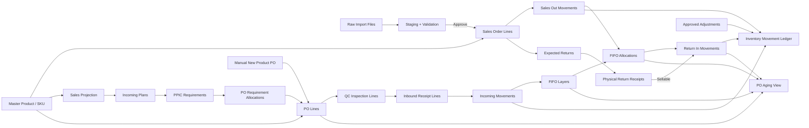

# VOBIA ERP — Logical Data Model

Status: Implemented MVP baseline 1.0  
Date: 20 August 2026

This document defines the target business entities and integrity boundaries. Core MVP entities now have executable Django migrations; items explicitly described as future/amendment/parallel-run records remain blueprint scope until their workflow is activated.

## 1. Data-model principles

- SKU detail is the inventory and transaction product key.
- Internal identifiers are UUIDs; business identifiers remain separately unique and readable.
- Posted business records are not hard-deleted.
- History is preserved through versions, status history, amendments, reversals, and append-only movements.
- Master changes never rewrite transaction, PO, opening-cost, or FIFO history.
- Quantity and money use exact database types; floating point is forbidden.
- Planning records are separate from actual operational records.
- Dashboard and PO Aging are derived from canonical data, not parallel manually edited totals.

## 2. High-level relationship map

## 3. Domain entities

### 3.1 Accounts and audit

#### `users`

- Username, password hash, active flag, superuser/permission foundation, credential timestamps.
- Initial record: `vobiasuperadmin`.
- Raw password is never stored.

#### `audit_events`

- Actor, action, entity type, entity ID, event time, reason, request/correlation ID, before values, after values, and metadata.
- Append-only through normal application access.
- Authentication, approval, amendment, reversal, adjustment, and configuration events are included.

### 3.2 Master data

#### `product_statuses`

- Canonical status code, name, active flag, and planning guardrails.

#### `categories` and `subcategories`

- Category hierarchy with stable identifiers.

#### `products`

- Parent/article identity, product name, status, category/subcategory, and active state.

#### `product_variants`

- Product-specific variant/color identity.

#### `skus`

- Unique detail SKU, product variant, size, current retail price, current master COGS, and active state.
- A used SKU can be deactivated but not hard-deleted.

#### `sku_value_history`

- Effective-dated history for retail price, master COGS, status, and other governed attributes.
- History supports explanation; operational documents keep their own immutable snapshots.

#### `marketplace_product_mappings`

- Source, marketplace product/parent-product code, product, effective dates, and active state.
- Traffic maps at product-page level, not detail-SKU level.

#### `suppliers`, `warehouses`, and `product_suppliers`

- Supplier/warehouse identity and status.
- Product-supplier relationship may later hold lead time and color-level MOQ once rules are approved.

### 3.3 Import control

#### `import_requirements`

- Dataset type, Source, start/end period, reason, nonfinal counts/statuses, latest cutoff, last successful import, and requirement status.

#### `raw_files`

- Private storage key, original filename, dataset type, Source, file checksum, byte size, detected format, upload time, and uploader.
- Raw file content remains immutable.

#### `import_batches`

- Raw file, parser version, import mode, lifecycle status, counts, validation summary, preview time, approval time, approver, commit time, and reversal reference.

#### `staged_sales_rows` and `staged_traffic_rows`

- Parsed but uncommitted values, raw-row number, normalized values, candidate business key, and proposed action.
- Staging is never counted as canonical Sales, Traffic, or Inventory.

#### `import_validation_issues`

- Batch, staged row, issue code, severity, field, message, blocking flag, and resolution.

### 3.4 Sales and traffic

#### `sales_orders`

- Source, unique order/invoice number within Source, order date/time, current normalized status, final flag, import/manual origin, and source metadata.

#### `sales_order_lines`

- Order, SKU, qty, net unit price, retail price snapshot, Sales-report COGS snapshot, gross/net/COGS/margin snapshot, and line business key.
- Unique canonical key: Source + No. Pesanan + SKU.
- Committed historical financial snapshots do not follow later master changes.

#### `sales_status_history`

- Order/line status transition, source status, normalized status, observed time, import batch/manual action, and reason.

#### `product_traffic_monthly`

- Source, month, marketplace product mapping, views/impressions, clicks, unique visitors, completeness state, source batch, and revision.
- Unique canonical grain: Source + month + marketplace product/parent-product code.

### 3.5 Merchandising

#### `projection_scenarios`

- Versioned planning workspace, period range, status, created by/time, approved by/time, and superseded reference.

#### `projection_rules`

- Scenario, target month(s), scope type, scope ID, method, percentage or Stock Ratio parameter, priority, and rule audit metadata.
- Priority: Product > Category > Product Status.

#### `sales_projections`

- Scenario, month, SKU, system recommendation, Adit adjustment, final approved qty, baseline month/value, method, approval status, and explanation.
- Unique grain: scenario + month + SKU.

#### `incoming_plans`

- Scenario, month, SKU, prior ending, minimum incoming, target ratio, recommended incoming, Adit adjustment, final approved incoming, approval status, and version.

### 3.6 PPIC and purchasing

#### `ppic_requirements`

- Need Month, SKU, approved incoming source/version, required qty, ordered qty, remaining qty, status, and revision.
- Business identity: Need Month + SKU with revision history.

#### `purchase_orders`

- Unique No. PO, one Supplier, one Need Month, Created At, Required Arrival, PO status, origin, release/amendment/cancellation metadata.

#### `purchase_order_lines`

- PO, SKU, PO Qty, unit COGS snapshot, line COGS total, and status.
- Snapshot is immutable after release except through an explicit audited amendment.

#### `po_requirement_allocations`

- PPIC requirement revision, PO line, and allocated qty.
- Prevents the same requirement qty from being ordered twice.

#### `po_amendments` and `po_status_history`

- Amendment number, reason, before/after values, effective time, and actor.
- Released PO changes are never in-place silent edits.

### 3.7 Quality and inbound

#### `qc_inspections` and `qc_inspection_lines`

- Inspection header: date, PO, checker, notes.
- Line: PO line/SKU, inspected qty, passed qty, failed qty, and cumulative validation.

#### `qc_failed_dispositions`

- QC line, affected qty, disposition, decision date, reason, and resulting operational/cost action.

#### `inbound_receipts` and `inbound_receipt_lines`

- Receipt header: receipt date, warehouse, receiver, notes.
- Line: PO line/SKU, Received Qty, QC Passed available at posting time, and inbound status.
- Cumulative Received Qty cannot exceed cumulative QC Passed.

### 3.8 Inventory and FIFO

#### `inventory_movements`

- Immutable movement key, date/time, type, SKU, warehouse, quantity delta, source document type/ID, source reference, posting batch, reversal reference, and audit metadata.
- Types: Opening, Incoming, Sales Out, Return In, Adjustment In, Adjustment Out.
- Corrections use reversal/adjustment movements, not row edits or deletes.

#### `fifo_layers`

- SKU, warehouse, source type, source opening/inbound line, available date, original qty, remaining qty, exact unit cost, and layer status.
- Opening layers use frozen 1 August 2026 COGS; inbound layers use PO-line snapshots.

#### `fifo_allocations`

- Sales Out movement, FIFO layer, allocated qty, exact unit cost, allocated cost, and allocation order.
- One Sales Out may consume multiple layers.

#### `inventory_adjustments`

- Requested movement direction/qty, SKU, warehouse, reason, evidence, status, approval, and posted movement reference.

#### `inventory_exceptions`

- Exception code/type, SKU, movement/layer reference, affected qty/cost, severity, open time, resolution, corrective document, and closed time.
- Negative Stock and FIFO Short remain open until a traceable correction is posted.

### 3.9 Returns

#### `expected_returns`

- Original Sales line, expected qty, marketplace/source evidence, current status, and remaining expected qty.
- Creation does not post inventory.

#### `return_receipts` and `return_receipt_lines`

- Physical receipt date, warehouse, receiver, Sales line, SKU, qty, condition, notes, and disposition status.
- Cumulative physical return cannot exceed original Sales Out without approved adjustment.

#### `fifo_return_restorations`

- Sellable return movement, original Sales FIFO allocation, restored qty, unit cost, restored cost, and source layer.
- Ensures return cost comes from the originating sale rather than current master COGS.

### 3.10 Reconciliation and cutover

#### `reconciliation_runs`

- Source system, dataset, period/cutoff, run time, rule version, totals, result, and evidence location.

#### `reconciliation_differences`

- Run, entity/key, field, source value, ERP value, difference, severity, explanation, resolution, and status.

#### `parallel_run_cycles`

- Cycle date, required checks, results, critical exception count, approver, and pass/fail status.
- Cutover eligibility requires seven consecutive passing cycles.

#### `cutover_approvals`

- Proposed cutover time, reconciliation evidence, exception statement, fallback plan, approval, and stabilization end decision.

## 4. Derived read models

These are database views/materialized read models or query services, not manually editable business tables:

- Available Inventory by SKU/Warehouse/Cutoff.
- Inventory Value and Running FIFO Cost.
- PO Tracking summary.
- PO Aging and Close/Reopen eligibility.
- Import Requirement dashboard.
- Sales and Traffic KPIs.
- MD Summary, MOS, and Stock Ratio.
- Reconciliation dashboard.

## 5. Core database constraints

- Unique SKU detail.
- Unique Source + No. Pesanan + SKU canonical Sales line.
- Unique Source + month + marketplace product code canonical Traffic record.
- Unique No. PO.
- One Supplier and one Need Month per PO.
- Positive PO/QC/inbound/return quantities.
- Passed + Failed cannot exceed Inspected.
- Cumulative inspected cannot exceed PO Qty.
- Cumulative inbound cannot exceed cumulative QC Passed.
- Cumulative physical return cannot exceed original Sales Out unless linked to an approved adjustment.
- PO requirement allocation cannot exceed remaining requirement.
- Posted movement and FIFO allocation rows cannot be updated/deleted through normal application permissions.
- Money and unit-cost columns use exact decimal/numeric precision.

## 6. Posting boundaries

Each operation is atomic: either all linked records commit or none do.

- Approved marketplace import → canonical Sales/status history → Sales Out movement → FIFO allocation/exception.
- PO create → number allocation → header/lines → requirement allocations → audit.
- QC posting → inspection/lines → cumulative checks → status update → audit.
- Inbound posting → receipt/lines → Incoming movement → FIFO layer → PO tracking update → audit.
- Sellable return posting → physical receipt → Return In movement → FIFO restoration → PO reopen evaluation → audit.
- Adjustment approval → adjustment record → movement → FIFO effect/exception resolution → audit.

User preview and confirmation occur before the short database posting transaction; a database transaction is never kept open while waiting for user input.

## 7. Deletion and correction policy

| Record state | Allowed correction |
|---|---|
| Draft/unposted | Edit or cancel with audit |
| Approved but not posted | Revoke approval with reason, if no downstream record exists |
| Posted/released | Amendment, reversal, cancellation, or compensating adjustment |
| Movement/FIFO allocation | Reversal/rebuild under controlled corrective workflow; never silent edit/delete |
| Raw import file | Immutable; a batch may be rejected/reversed but evidence remains |

## 8. Time, timezone, and periods

- Store precise event timestamps consistently; display business time in Asia/Jakarta.
- Store business dates separately where operational rules depend on a date rather than an instant.
- Month uses a real year-month value internally; labels such as `8. August` are presentation only.
- Cutoff/as-of time accompanies every inventory, Sales, and reconciliation result.

## 9. Physical-schema prerequisites

Before executable Django models and PostgreSQL migrations are created, verify read-only:

- Canonical Bank Data source workbook/tab/header/key.
- Sales and MD workbook live headers and data types needed for migration/reconciliation.
- Representative raw Shopee/TikTok transaction and traffic export headers.
- Current PO, QC, inbound, return, movement, and FIFO source schemas.
- Actual volume: rows per month, raw-file size, SKU count, PO/return frequency.
- Supplier and warehouse master requirements.

No live workbook or production data is changed by this logical model.

Read-only source-schema audit started on 19 August 2026. Verified results are recorded in `../docs/SOURCE-SCHEMA-AUDIT-2026-08-19.md` and must be applied before executable models/migrations are finalized.
